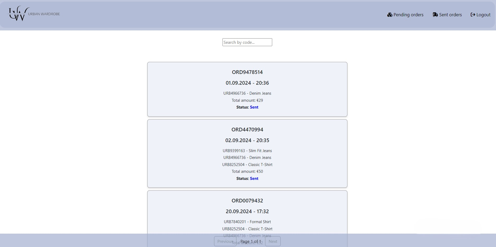

# UrbanWardrobe
UrbanWardrobe is an online clothing store designed to offer the latest fashion trends with a seamless shopping experience. This project is a full-stack web application that allows users to browse, select, and purchase clothing items effortlessly.

## Tech Stack
- **Frontend**: HTML, CSS, JavaScript, Angular, Node.js
- **Backend**: Java, Spring Boot
- **Database**: MySQL
- **Authentication**: JWT (JSON Web Tokens)
- **Authorization**: RBAC
- **Other**: MinIO, Docker

## Installation and Setup
To run this project locally, follow these steps:

1. Clone the repository:
   git clone repository-url, 
   cd urbanwardrobe

2. Set up the database:
Create a new database in MySQL using: create database urbanwardrobe. Set up datasource url in application.properties.

3. Build and run the Docker containers:
Navigate to the directory where docker-compose.yml is placed and execute: docker-compose up --build.

4. Run the backend application:
Navigate to the backend directory and run: mvn spring-boot:run.
   
5. Run the frontend application:
Navigate to the frontend directory and run: npm install then ng serve.

Open the project at: http://localhost:4200

